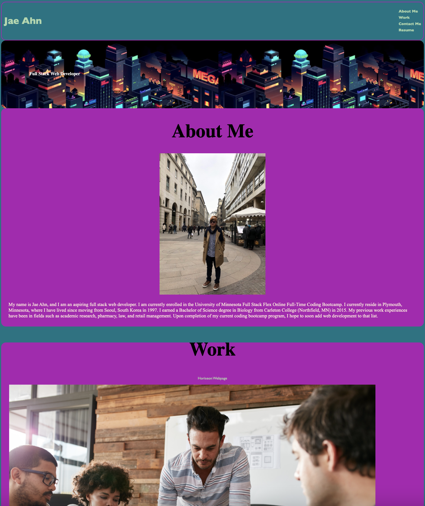
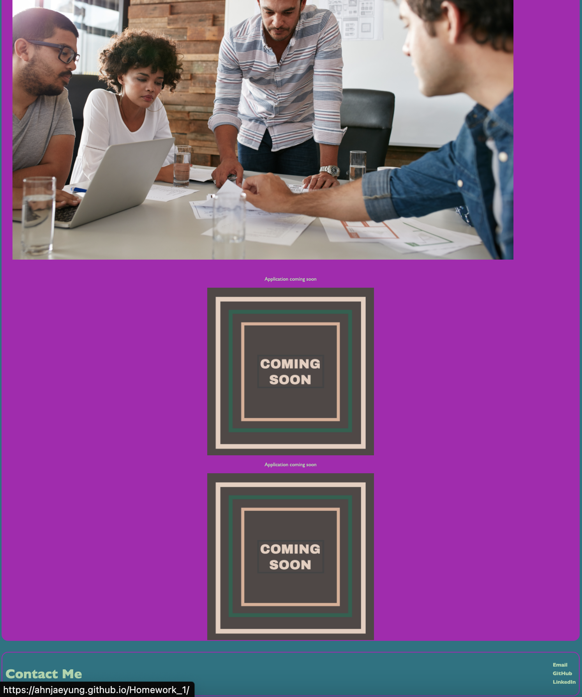

# Homework 2: Professional Porfolio #
Professional Portfolio Webpage

My professional portfolio webpage.  This webpage presents my name, recent picture, a biographical section about me, my work, and my contact information.  The header of this webpage includes a navigation bar with functional links for *About Me*, *Work*, and *Contact Me* that the user can click, and the UI will scroll to the corresponding section.  The *Resume* link in the navigation bar has not been linked to lead the user anywhere yet, but hovering over it will change the font color similar to the functional links in the navigation bar.  Below the header is a banner with a subtitle "Full Stack Web Developer" and a background image of a neon cityscape that was found online.

The *About Me* section includes a photo of me as well as a biographical background which details my name, career aspirations, what I am currently doing, my educational background, and my past work experiences.  The *Work* section includes three images in a column. The first and largest image titled "Horiseon Webpage" is a link that can be clicked to take the user to the Horiseon Webpage.  The other two images in this section are reserved for applications which have not yet been completed.  These two images are not clickable links.  

The footer of this webpage contains the *Contact Me* section.  This section includes three functional links.  When clicked, the first link, *Email*, will open the user's default mail program and create a new message with the TO field filled out with my email address.  The second and third links, *GitHub* and *LinkedIn*, will take the user to my GitHub and LinkedIn pages respectively.

Media Query was used for this webpage to change the border color and font-family of the footer and header depending on the screen size of the device used to view this webpage.

Link to Deployed Webpage
---------------
[Professional Portfolio](https://ahnjaeyung.github.io/Homework_2_Professional_Porfolio/)